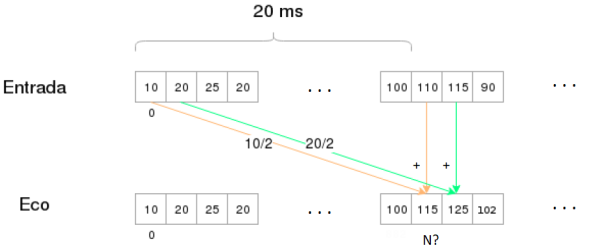

# Facultad de Ingeniería
## Universidad de Buenos Aires

### Carrera de Especialización en Sistemas Embebidos
---
## Guía Práctica 3
**Uso de instrucciones DSP en Assembly**

### Introducción
Se pide realizar los ejercicios primero en C, luego en Assembly y por último en Assembly
pero con instrucciones DSP, verificando posteriormente que el algoritmo funcione
correctamente. Compare los tiempos de ejecución en ciclos de cada función y compare
cuánto tarda en ejecutarse en C contra Assembly, y contra Assembly con DSP.
Se recomienda que los ejercicios se hagan de manera consecutiva y que se realicen
comentarios de manera prolija y ordenada. Implementar todas las funciones en un mismo
archivo.

### Ejercicio 1
Implementar una función que calcule la potencia de una señal discreta x[n] con datos
signados de 16 bits aplicando la siguiente ecuación:

\[P = \frac{1}{N} \sum_{n=0}^{N-1} (x[n])^2\]

Donde P es un número sin signo de 32 bits. Utilizar los siguientes prototipos para la
funciones:

```c
uint32_t asm_potencia (int16_t * vecIn, uint32_t longitud);
uint32_t asm_potencia_DSP (int16_t * vecIn, uint32_t longitud);
```

### Ejercicio 2
Implementar una función que calcule el vector de diferencia media entre dos señales
discretas x[n] e y[n] con datos signados de 8 bits y de igual cantidad de elementos,
aplicando la siguiente ecuación:

\[e[n] =\frac{x[n] - y[n]}{2}\]

Donde e[n] es un vector con datos de 8 bits con signo. Utilizar los siguientes prototipos para
la funciones:

```c
void asm_medDif(int8_t * e, int8_t *x, int8_t *y, uint16_t longitud);
void asm_medDif_DSP(int8_t * e, int8_t *x, int8_t *y, uint16_t longitud);
```

### Ejercicio 3
Realizar una función que recibe un vector de 4096 valores de 16 bits signados, que
corresponden a muestras de audio tomadas a una tasa de muestreo de 44.100 muestras/s.
La función debe introducir un “eco” que consiste en adicionar a la señal original, la propia
señal original dividida por dos y atrasada en 20 mseg., como muestra la ilustración debajo.
¿A partir de qué muestra se debería implementar el eco?



Utilizar los siguientes prototipos de función:

```c
void asm_eco (int16_t * signal, int16_t *eco, uint32_t longitud);
void asm_eco_DSP (int16_t * signal, int16_t *eco, uint32_t longitud);
```

Sugerencia: Puede utilizar la función `rand()` para generar los valores del vector de muestra.
